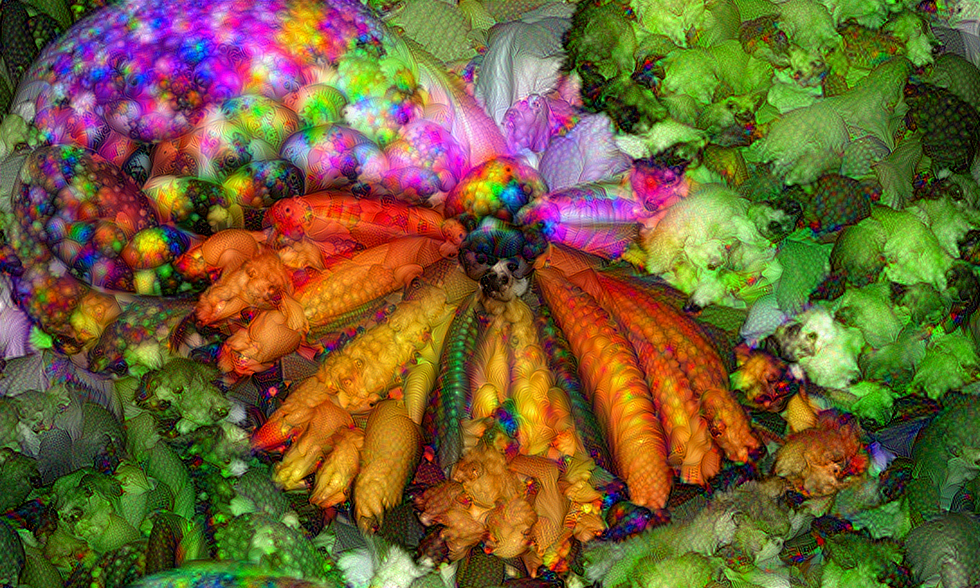
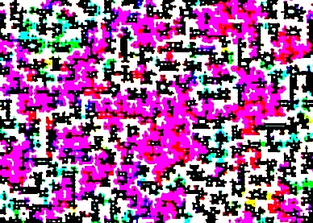
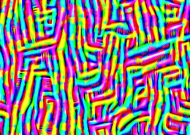
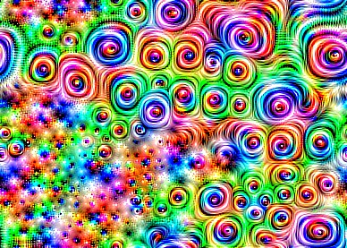
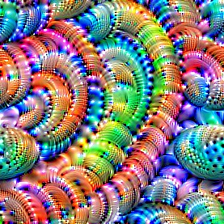

# The Deep Dream Algorithm 💻💤💤
Creating Vivid Visualizations with Machine Learning and Math: Activation Maximization Through Gradient Ascent

  

## What is Deep Dream, and how can a computer "Dream"?

As image recognition, object detection and segmentation neural networks get more advanced, they suffer more and more from a lack of interpretability. Interpretability is a critical and often overlooked aspect of Machine Learning; how can we trust the models we build? The Deep Dream algorithm offers a growing solution to the poor interpretability of neural networks by shining a light into the notorious "black box" of these models. 

Deep Dream performs Activation Maximization, also known as Feature Visualization, in order to reveal the features that a given convolutional neural network is looking for. By maximally activating the brain of the model, we get vivid visualizations of the learned representations. 

## InceptionV3: Trained on ImageNet

  

  

## VGG16 Layers Visualized: Trained on ImageNet

## Shallow Layers
Layers closer to the input and beginning of the network contain simple edges and patterns.

 

## Deeper Layers
Deeper Layers, layers closer to the classification layers and output, contain higher level features like eyes.

 

One example video I made: https://www.youtube.com/watch?v=oWClAmB6xAM

## Getting Started

Open the jupyter notebook and create a Dreamer object with the default hyperparameters. Call the object with your input image to start spectating the dreaming process! Fine tuning hyperparameters is really a matter of trial and error, since what you find visually pleasing is completely subjective! I hope you enjoy this project and find this example useful.

I also recommend you check out an excellent tutorial at https://www.tensorflow.org/tutorials/generative/deepdream , and a brilliant article https://ai.googleblog.com/2015/06/inceptionism-going-deeper-into-neural.html
