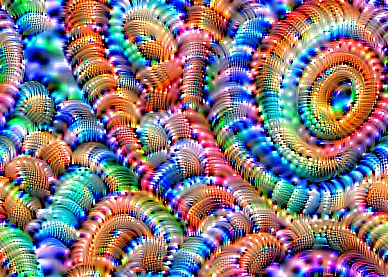

# The Deep Dream Algorithm 💻💤💤
Creating Vivid Visualizations with Machine Learning and Math: Activation Maximization Through Gradient Ascent

  

## What is Deep Dream, and how can a computer "Dream"?

As image recognition, object detection and segmentation neural networks get more advanced, they suffer more and more from a lack of interpretability. Interpretability is a critical and often overlooked aspect of Machine Learning; how can we trust the models we build? The Deep Dream algorithm offers a growing solution to the poor interpretability of neural networks by shining a light into the notorious "black box" of these models. 

Deep Dream performs Activation Maximization, also known as Feature Visualization, in order to reveal the features that a given convolutional neural network is looking for. By maximally activating the brain of the model, we get vivid visualizations of the learned representations. 

## Human Brains vs Artificial Brains (VGG16 CNN Layers Trained on the ImageNet Dataset):

Here are some examples of the VGG16 layers visualized:

### Shallow Layers
Layers closer to the input and beginning of the network contain simple edges and patterns. 

 

### Deeper Layers
Deeper Layers, layers closer to the classification layers and output, contain higher level features like eyes.

 

### Parallels to the Human Mind
A Convolutional Neural Network architecture learns a separation of concerns that draws natural parallels to the human visual cortex areas. In our primary visual cortex, 6 layers of cells extract basic information of the visual field, some of which is edges, orientation, and color of objects. A ventral stream then passes through the secondary visual cortex; neurons in this region are responsible for recognizing objects, such as faces, based on their size, shape, and color. In convolutional neural networks, the receptive fields of earlier layers of the network capture edges, orientations, and colors, just like the primary visual cortex. Also, the later layers capture higher complexity information like patterns and objects themselves, similar to the secondary visual cortex. This mathematically learned visual system is incredibly biomimetic, it mimics our neurobiology, and there may be cause for augmenting current state-of-the-art models with insights from Cognitive Science. 

## InceptionV3: Trained on ImageNet

We can also input any input image to see how the model might "hallucinate" learned features, resulting in some psychedlic imagery. Here are some exciting examples:

  

  

One example video I made early in the creation of this program: https://www.youtube.com/watch?v=oWClAmB6xAM

## Getting Started

Create a Dreamer object with the default hyperparameters. Call the object with your input image to start spectating the dreaming process! Fine tuning hyperparameters is really a matter of trial and error and personal preference, since what you find visually pleasing is completely subjective! I hope you enjoy this project and find this example useful in your own investigations of image recognition models.

I also recommend you check out an excellent tutorial at https://www.tensorflow.org/tutorials/generative/deepdream , and a brilliant article https://ai.googleblog.com/2015/06/inceptionism-going-deeper-into-neural.html
